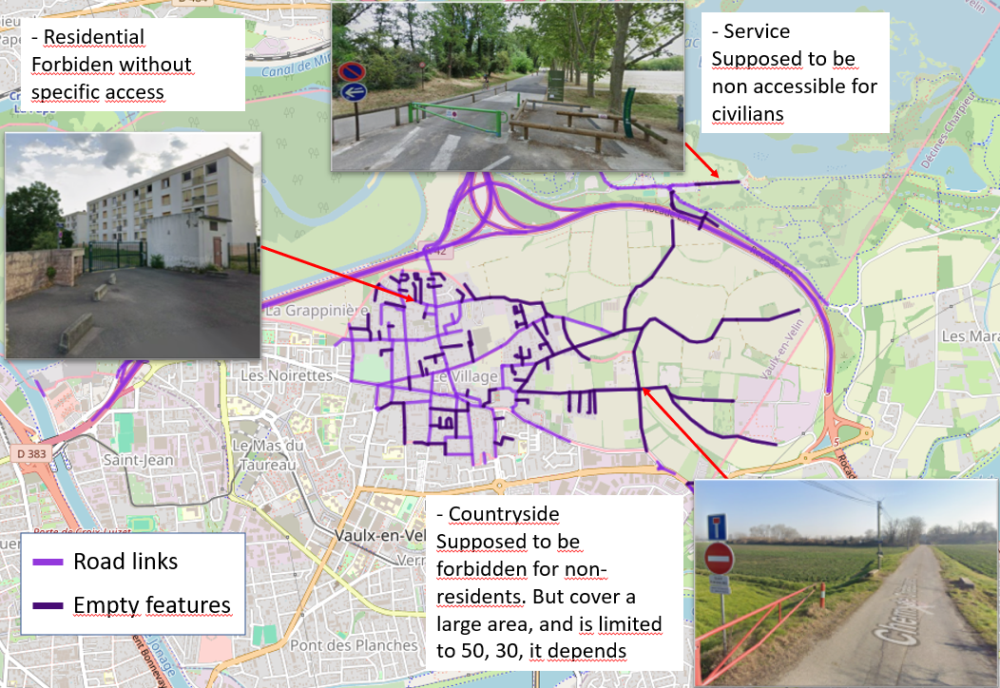

# Multi-Modal Network Extration (MMNE)
The repository aims to provide an automated pipeline where a multimodal transport network can be generated that is entirely projected onto the same graph (OSM).

In a second phase, it will involve generating OD matrices and calibrating demand models from loop sensors.

## Usage example:
### Environment : 
python: 3.12.13
aequilibrae: 1.6.2
folium: 0.20.0
networkx: 3.6.1
geopandas: 1.1.3
streamlit: 1.57.0        
streamlit-folium: 0.27.2

### Input for operation:

Input are stored data in a `data/` folder containing :
- a subfolder associated with the studied city (e.g., `data/lyon/`), where:
  - the raw data file is located (e.g., `data/lyon/raw_data/`), containing the necessary data for the construction of the transport network:
    - Bike network: `net_bike/shapes/` containing the files `links_processed.shp` and `nodes_processed.shp`
    - Iris Zones: `net_car/shapefiles_sym/` containing the IRIS zones shapefile
    - Public Transport: `net_pt/GTFS/` containing the GTFS folder.zip (e.g., `net_pt/gtfs/lyon_tcl_gtfs.zip`), composed of .txt files (e.g., `stops.txt`, `stop_times.txt`, `trips.txt`, `routes.txt` ...)
#### Example of expected tree: 
```text
data/
└── Lyon/
    ├── raw_data/
    │   ├── net_bike/
    │   │   └── shapes/
    │   │       ├── links_processed.cpg
    │   │       ├── links_processed.dbf
    │   │       ├── links_processed.shp
    │   │       ├── links_processed.shx
    │   │       ├── nodes_processed.cpg
    │   │       ├── nodes_processed.dbf
    │   │       ├── nodes_processed.shp
    │   │       └── nodes_processed.shx
    │   ├── net_car/
    │   │   └── shapefiles_sym/
    │   │       ├── Iris_Lyon.dbf
    │   │       ├── Iris_Lyon.shp
    │   │       └── Iris_Lyon.shx
    │   └── net_pt/
    │       └── GTFS/
    │           └── lyon_tcl_gtfs.zip
```


### Notebook: 

Open `build_network.ipynb` and run the cells to generate the multimodal transport network.

This specific configuration (available in `config/Lyon_multimodal.py`) will generate a multimodal transport network (including the car, bike, walk, and public transport) for the city of Lyon, where you can select the study area by drawing a Polygon. t networks.

### Save / load a network:

```python
multi_modal_network.save()          # -> data/Lyon/ready_input/networks/<YYYYMMDD_HHMM>/  (or .save(path))
networkbuilder, aequilibraebuilder, gtfs_network_builder = multi_modal_network.load(path)
```
- A saved network is a folder with `network.gpkg` (one layer per GeoDataFrame, readable in QGIS) and `metadata.json` (parameters, CRS, git commit, known defects).
- `load()` needs no Streamlit, no OSM download and no GTFS import. The visualisation cell works the same after `build()` or `load()`.
- Setting `--save_path` in `config/Lyon_multimodal.py` saves automatically at the end of `build()`.
- Tests: `python tests/test_network_io.py`

### Map layers:
- `Bike Lanes` and `Cycling Lanes Lanes` come from the **OSM** network (AequilibraE).
- `own_loaded_bikes Lanes` (all links) and `own_loaded_bikes is_bike Lanes` (`is_bike == 1`) come from **our own** bike shapefiles (`net_bike/shapes/*_processed.shp`, Lambert-93).
- Bus map matching (GTFS → OSM), to check it visually:
  - `PT bus GTFS init - matched Lanes` / `PT bus GTFS init - not matched Lanes`: initial GTFS bus sub-routes (clipped by the study area). The tooltip gives the map matching outcome (`status`: `matched`, `path_too_short_dropped`, `no_path`, `no_start_or_end_link`, `no_candidate_link`), lengths and the Hausdorff distance (m) between the initial and the map matched geometries.
  - `PT bus map-matched Lanes`: bus sub-routes rebuilt from OSM links (`final_pt_links`).
  - `PT bus OSM links used Lanes`: OSM links selected by the map matching (`final_matches`).
  - Networks saved before this feature have no `PT bus GTFS init` layers: rebuild them to get these layers.

## Good to know:

- **Study area = union of all IRIS zones that intersect the drawn polygon** (not the exact polygon). Networks, public transport and zones are extracted on this larger area.

- When testing the package, try by drawing a very small area (e.g. ~100m2) to avoid long processing times.

- If Links.shp and Nodes.shp from GTFS are not already saved, pre-processing can be particularly time-consuming (~1h for Lyon on a standard laptop). After this step, they are saved in `net_pt/lines/lines.shp` and `net_pt/stops/stops.shp` to avoid having to redo the extraction each time.

- Some road traffic link can have non-null capacity and speed values in one direction, but the number of lanes is null or None. 
  - `What is supposed to be forbiden is` to have non null values for lanes number and null values for either speed or capacity.

- Some road trafic lanes have both ab and ba set to 0 or null. 
  - When speed feature is not None, we decided to set them to  `lanes_ab = 1` and `lanes_ba = 1`. 
    - These road trafic lanes are visible in `build_network` and identified by the layer `'car anomalies Lanes'`.  
  - When speed (and also capacity) feature is None, we cannot assume anything about them. Most of the time, these are not usefull road links. But sometimes as on the second picture, there is an issue. and we have to infer what is happening on the missing lane. Here, it's actually a roundabout that's under construction
  - "`Empty feature` road link is identified as a link without "lanes_ab","speed_ab", "capacity_ab" for both direction.
    - 
    - 

## To do later on:
- Correct errors during map-matching of bus lines on the OSM network
- Correct errors on missing features in the road traffic network 
- Currently, builds all defined possible modes.
  - To do: Add exceptions to handle the import of a subset of modes among [Car, Public transport, bike, walk]
- `utils/network.py` has been arbitrarily filled with assumptions that should be revised
- `arrows` from `bike` lack one direction.