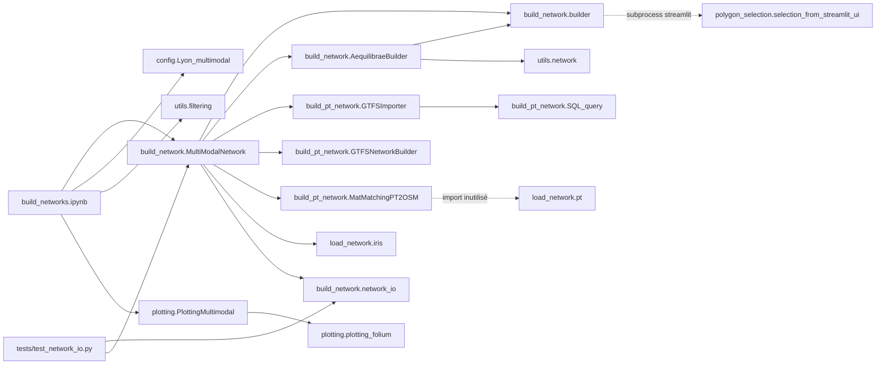

# Graphe de dépendances

Retour : [vue_ensemble.md](vue_ensemble.md)

## Imports internes (modules actifs)

Points notables :
- `AequilibraeBuilder` **hérite** de `NetworkBuilder` mais ne s'en sert que pour les attributs par défaut (OBS-09) ; il importe aussi `load_init_area` depuis `builder.py`.
- `MatMatchingPT2OSM` importe `get_candidates_links` depuis `load_network.pt` sans l'utiliser (il a sa propre méthode) : seul lien vers ce module legacy (OBS-15).
- `load_network.iris` est le **seul** module de `load_network/` réellement utilisé par le pipeline.
- L'UI Streamlit n'est pas importée : elle est lancée en **sous-processus** (communication par fichiers + variable d'environnement `TEMP_GDF_PATH`).
- Pas d'import circulaire. Les `__init__.py` sont vides ; les imports supposent que la racine du dépôt est dans `sys.path` (cwd = racine), sauf `load_network/car.py` qui modifie `sys.path` lui-même.

## Modules legacy / isolés

| Module | Importé par | Dépend de |
|---|---|---|
| `load_network/car.py` | `Ignore/load_networks.ipynb` | `utils.network` |
| `load_network/bike.py` | `Ignore/load_networks.ipynb` | `utils.network.load_shp_from_2154` |
| `load_network/area.py` | `Ignore/load_networks.ipynb` | — |
| `load_network/pt.py` | (import mort dans `MatMatchingPT2OSM`) | — |
| `utils/conversion_gtfs.py` | aucun (script `__main__`) | `mnms`, `gtfs_functions`, `coordinates`, `unidecode` |

## Dépendances externes

| Librairie | Version README | Utilisée dans | Usage |
|---|---|---|---|
| aequilibrae | 1.6.2 | `AequilibraeBuilder`, `GTFSImporter` | `Project.new`, `create_from_osm` (téléchargement OSM), `Transit` (GTFS + map-matching), export GMNS, SQLite/Spatialite |
| geopandas | 1.1.3 | partout | lecture SHP/GeoJSON, `sjoin`, `clip`, `to_crs`, `union_all` |
| shapely | (non listée) | pt, iris, streamlit UI | géométries, `linemerge`, `hausdorff_distance` |
| networkx | 3.6.1 | `MatMatchingPT2OSM`, `load_network/pt.py` | graphe candidat + `bidirectional_dijkstra` |
| folium | 0.20.0 | `plotting/`, UI Streamlit | carte ; **reprojette automatiquement en 4326** les GeoDataFrame |
| streamlit / streamlit-folium | 1.57.0 / 0.27.2 | `polygon_selection/` | dessin du polygone |
| pandas, numpy, tqdm | (non listées) | partout | — |
| xyzservices | (non listée) | `PlottingMultimodal` | import présent, usage commenté |
| matplotlib | (non listée) | `builder.py`, `AequilibraeBuilder.py` | import inutilisé |
| mnms, gtfs_functions, coordinates, unidecode | (non listées) | `utils/conversion_gtfs.py` uniquement | — |

Aucun `requirements.txt` / `environment.yml` dans le dépôt (OBS-18).
