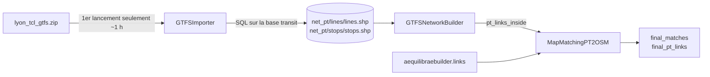

# Module : transport public (GTFS → OSM)

Retour : [vue_ensemble](../vue_ensemble.md) · Voisins : [reseau_routier.md](reseau_routier.md), [visualisation.md](visualisation.md) · Dossier : [build_network/build_pt_network/](../../../build_network/build_pt_network/)

## Chaîne en 3 classes

### 1. `GTFSImporter` — [GTFSImporter.py](../../../build_network/build_pt_network/GTFSImporter.py)

| Méthode | Ligne | Rôle |
|---|---|---|
| `__init__` | 12 | lance `_start()` puis `_load_gtfs_route()` **dans le constructeur** |
| `_start` | 32 | nouveau projet AequilibraE temporaire + **second** téléchargement OSM + `Transit.new_gtfs_builder` + `load_date` |
| `_load_gtfs_route` | 44 | `map_match()` AequilibraE (long) + `save_to_disk()` + connexion `database_connection("transit")` |
| `_SQL_extract` | 57 | `_tackle_trips` → `_tackle_enriched_nodes` → `_save_shapefiles` → `_provide_information` — **jamais appelée** |
| `_save_shapefiles` | 91 | utilise `self.gtfs_folder_name`, **attribut inexistant** |

→ Le premier lancement ne peut pas produire les SHP attendus : **OBS-02**. Le pipeline fonctionne actuellement parce que `net_pt/lines` et `net_pt/stops` existent déjà.

Requêtes : [SQL_query.py](../../../build_network/build_pt_network/SQL_query.py) — `sql_links_query` (trips ⋈ routes : `trip_id, route_id, line_name, mode, geometry`), `sql_enriched_nodes_query` (arrêts + lignes/modes qui les desservent).

### 2. `GTFSNetworkBuilder` — [GTFSNetworkBuilder.py](../../../build_network/build_pt_network/GTFSNetworkBuilder.py)

- `_load_network` (ligne 10) : lit `lines.shp`, `stops.shp`, calcule `unique_routes` (inutilisé).
- `restrain_to_area_study(polygon)` (ligne 15) : jointure spatiale avec **`polygon.exterior`** (le contour, pas la surface), puis intersection géométrique avec le polygone, `explode`, nettoyage → `pt_links_inside`, `pt_nodes_inside`. Effet probable : lignes entièrement intérieures et arrêts intérieurs perdus ; `.exterior` inexistant sur un MultiPolygon (**OBS-03**).
- Copie quasi identique : `restrain_to_area_study` dans [load_network/pt.py:17](../../../load_network/pt.py#L17).

### 3. `MapMatchingPT2OSM` — [MatMatchingPT2OSM.py](../../../build_network/build_pt_network/MatMatchingPT2OSM.py)

`match_pt_to_osm(pt_links_inside, aequilibraebuilder)` (ligne 25) :
1. Liens routiers candidats = `aequilibraebuilder.links` hors types exclus (`pedestrian, footway, path, cycleway, steps, elevator, construction, living_street`), passés en 2154.
2. Tracés **bus uniquement** (`mode_name == 'Bus'`), dédoublonnés par (géométrie, route, mode) (**OBS-10**).
3. `_get_candidates_links` : `sjoin` liens ∩ buffer 10 m du tracé.
4. `_find_bus_route_extremities` : liens touchant un buffer de 10 m autour du premier/dernier point.
5. Pour chaque sous-tracé : `_find_best_path_for_route_optimized` → poids `calculate_edge_weight` = Hausdorff² + |Δlongueur| + 1, `bidirectional_dijkstra` entre toutes les paires de nœuds début/fin (graphe **non orienté**).
6. Chemins de plus de 2 liens seulement → `final_pt_links` (tracé recomposé) ; tous les liens retenus → `final_matches`. Sorties en **2154**.

**Diagnostic (PLAN-002)** : `match_pt_to_osm` enregistre aussi `self.bus_routes_diagnostics` (méthode `_build_diagnostics`) : un tronçon GTFS de bus par ligne (2154), avec `status` (`matched`, `path_too_short_dropped`, `no_path`, `no_start_or_end_link`, `no_candidate_link`), `n_candidates`, `n_links_path`, `len_init_m`, `len_matched_m`, `hausdorff_m`. Exposé par `MultiModalNetwork` sous le nom `gtfs_network_builder.pt_bus_routes_init`, sauvegardé avec le réseau et affiché sur la carte ([visualisation](visualisation.md)). Les sorties `final_matches` / `final_pt_links` sont inchangées.

Code mort dans la classe : `_find_possible_extremities` (filtre prévu, jamais appliqué), `find_best_path_for_route` (force brute avec `print`). L'import `get_candidates_links` depuis `load_network.pt` est inutilisé ; `load_network/pt.py` est une version fonctionnelle antérieure du même algorithme (**OBS-15**).

## Diagnostic du 2026-09-25

Chiffres détaillés dans [AUDIT-002 — map-matching des bus](../../audit/AUDIT-002_map_matching_bus.md). Sur la zone de test, 17 tronçons de bus sur 127 obtiennent un tracé, car les lignes sont découpées en fragments avant d'être projetées. Les tracés obtenus s'écartent du GTFS de 101 m en médiane. Depuis [PLAN-002](../../plan/PLAN-002_affichage_diagnostic_map_matching.md), la carte affiche le GTFS initial (matched / not matched), le tracé map-matché et les liens OSM utilisés.

## Limites connues (README « To do »)

- Erreurs de map-matching des bus sur OSM (pas de sens de circulation, pas de contrôle de continuité, graphe non orienté).
- Tram / métro / funiculaire non projetés, donc absents de la couche « PT ».
- Pas d'horaires ni de fréquences exploités après l'import (la base `transit` d'AequilibraE n'est pas conservée).
