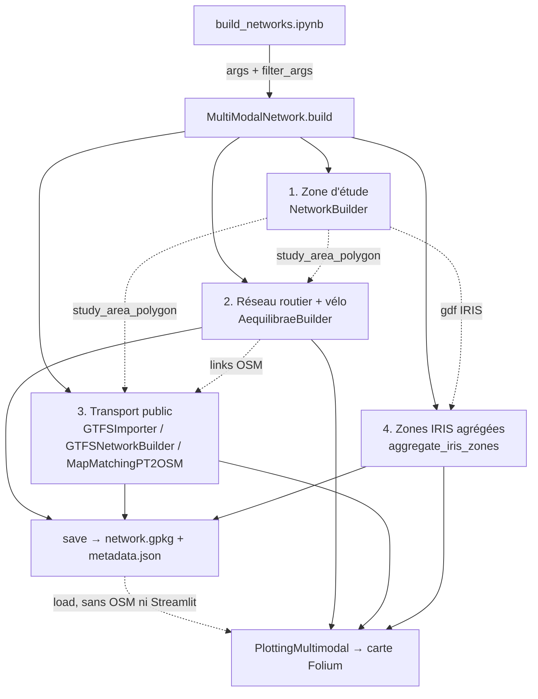

# Vue d'ensemble du dépôt MMNE

Retour : [README](../README.md) · Suite : [pipeline_execution.md](pipeline_execution.md) · [graphe_dependances.md](graphe_dependances.md)

## Objectif du projet

Générer automatiquement, pour une zone d'étude choisie, un **réseau de transport multimodal** (voiture, vélo, marche, transport public) **projeté sur un même graphe OSM**, puis (phase 2, non commencée) des **matrices OD** et le **calibrage de modèles de demande** à partir de capteurs de boucle (voir [plan/feuille_de_route.md](../plan/feuille_de_route.md)).

Cas d'étude : **Lyon** (IRIS INSEE, GTFS TCL du 2024-08-14).

## Pipeline en 4 étapes

## Carte des modules

| Dossier / fichier | Rôle | Statut | Fiche |
|---|---|---|---|
| [build_networks.ipynb](../../build_networks.ipynb) | **Point d'entrée** utilisateur (2 cellules de code) | actif | [pipeline_execution.md](pipeline_execution.md) |
| ~~`anomalies.ipynb`~~ | Variante exploratoire du notebook (anomalies de voies) — **supprimé par l'utilisateur** (2026-09-25, non commité), contenu intégré à `build_networks.ipynb` | supprimé | [code_legacy.md](modules/code_legacy.md) |
| [config/Lyon_multimodal.py](../../config/Lyon_multimodal.py) | Paramètres (`argparse`, parsés à vide) | actif | [config.md](modules/config.md) |
| [build_network/MultiModalNetwork.py](../../build_network/MultiModalNetwork.py) | **Orchestrateur** des 4 étapes | actif | [orchestration.md](modules/orchestration.md) |
| [build_network/network_io.py](../../build_network/network_io.py) | Sauvegarde / chargement GeoPackage + métadonnées | actif (PLAN-001) | [orchestration.md](modules/orchestration.md), [donnees_et_crs.md](donnees_et_crs.md) |
| [tests/test_network_io.py](../../tests/test_network_io.py) | Tests hors ligne de la sauvegarde (`python tests/test_network_io.py`) | actif | — |
| [build_network/builder.py](../../build_network/builder.py) | `NetworkBuilder` : sélection de la zone d'étude | actif | [orchestration.md](modules/orchestration.md) |
| [build_network/polygon_selection/](../../build_network/polygon_selection/selection_from_streamlit_ui.py) | UI Streamlit pour dessiner le polygone | actif | [orchestration.md](modules/orchestration.md) |
| [build_network/AequilibraeBuilder.py](../../build_network/AequilibraeBuilder.py) | Extraction OSM + prétraitement + vélo | actif | [reseau_routier.md](modules/reseau_routier.md), [velo_marche.md](modules/velo_marche.md) |
| [build_network/build_pt_network/](../../build_network/build_pt_network/) | Import GTFS, découpage, map-matching bus→OSM | actif | [transport_public.md](modules/transport_public.md) |
| [utils/network.py](../../utils/network.py) | Hypothèses voies / vitesses / capacités | actif | [reseau_routier.md](modules/reseau_routier.md) |
| [utils/filtering.py](../../utils/filtering.py) | `filter_args` (args → kwargs d'un constructeur) | actif | [config.md](modules/config.md) |
| [load_network/iris.py](../../load_network/iris.py) | Agrégation spatiale des IRIS | actif (seule fonction utilisée de `load_network/`) | [zones_iris.md](modules/zones_iris.md) |
| [load_network/pt.py](../../load_network/pt.py) | Ancienne version fonctionnelle du map-matching | 1 import résiduel | [code_legacy.md](modules/code_legacy.md) |
| `load_network/{car,bike,area}.py` | Chargement depuis CSV/SHP pré-exportés | legacy (non appelé) | [code_legacy.md](modules/code_legacy.md) |
| [plotting/](../../plotting/) | Carte Folium multicouche | actif | [visualisation.md](modules/visualisation.md) |
| [utils/conversion_gtfs.py](../../utils/conversion_gtfs.py) | Script autonome GTFS → MnMS (« WORK IN PROGRESS ») | non branché | [code_legacy.md](modules/code_legacy.md) |
| `Ignore/` | Anciens notebooks, notes de réunion, utilitaires d'affectation DUE | hors pipeline (ignoré par git) | [code_legacy.md](modules/code_legacy.md) |
| `data/` | Données brutes et sorties (ignoré par git) | — | [donnees_et_crs.md](donnees_et_crs.md) |

## Objets centraux (ce qui circule entre les étapes)

| Objet | Produit par | Consommé par | Type / CRS |
|---|---|---|---|
| `networkbuilder.gdf` | `NetworkBuilder.run` | `_build_zones`, plot | GeoDataFrame IRIS (4326 si sélection par polygone, voir OBS-06) |
| `networkbuilder.study_area_polygon` | `NetworkBuilder.run` (`gdf.union_all()`) | OSM, GTFS, zones, vélo | shapely Polygon/MultiPolygon |
| `aequilibraebuilder.links` / `.nodes` | `extract_network_from_osm` | map-matching, plot | GeoDataFrame 4326 |
| `aequilibraebuilder.traffic_network` | `preprocess_network` | plot | = `links` enrichi (`lanes_*`, `capacity_*`, `added_lane`) |
| `aequilibraebuilder.bike_lanes` / `.bike_nodes` | `add_bike_network` | plot (`own_loaded_bikes`) | GeoDataFrame 4326 (depuis 2154) |
| `gtfs_network_builder.final_pt_links` / `.final_matches` | `MapMatchingPT2OSM.match_pt_to_osm` | plot | GeoDataFrame **2154** |
| `multi_modal_network.gdf_init_zones` / `.gdf_agg_zones` | `_build_zones` | plot | GeoDataFrame 4326 |

## Constats majeurs

Les défauts repérés sont centralisés dans [audit/AUDIT-001](../audit/AUDIT-001_exploration_initiale.md). Les plus structurants :
OBS-02 (import GTFS au premier lancement), OBS-03 (découpage TC sur le contour, confirmé : 0 arrêt retenu sur la zone test), OBS-20 (le multimodal n'est pas encore connecté). OBS-01 (vélo, CRS) est corrigé par PLAN-001.
