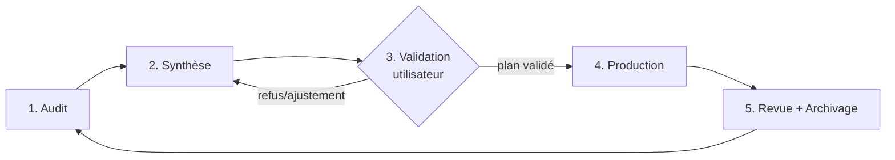

# Cycle de travail commun

Retour au hub : [README.md](../README.md) · Conventions : [conventions.md](conventions.md)

## Les 5 étapes (non contournables)

| Étape | Qui | Produit | Où | Porte de sortie |
|---|---|---|---|---|
| 1. Audit | [auditeur](../skills/auditeur/SKILL.md) | Constats `OBS-xx`, **sans correctif appliqué** | `audit/AUDIT-NNN_*.md` | rapport complet |
| 2. Synthèse | auditeur | Résumé priorisé + questions à l'utilisateur | en tête du rapport d'audit + [ETAT.md](../ETAT.md) | utilisateur notifié |
| 3. Validation | **utilisateur** | Choix des constats retenus, arbitrages | `plan/PLAN-NNN_*.md` passe à `VALIDE` | accord **explicite** écrit |
| 4. Production | [dev](../skills/dev/SKILL.md) | Modifications de code limitées au périmètre du plan | code + cases cochées dans le plan | checklist de livraison OK |
| 5. Revue + archive | auditeur (revue), puis n'importe quel agent | Vérification, puis résumé condensé | `archive/JOURNAL.md` | plan `TERMINE`, ETAT.md mis à jour |

## Règles impératives

1. **Pas de modification sans accord.** Un agent qui détecte un problème le **consigne** (constat d'audit, ou note « hors périmètre » dans le plan en cours) ; il ne le corrige pas.
2. **Le périmètre d'un plan est fermé.** Le dev ne modifie que ce que le plan validé liste. Toute découverte en cours de route → note dans la section « Découvertes » du plan + question à l'utilisateur.
3. **Pas d'action irréversible sans demande explicite** : commit, push, suppression de fichiers ou de données, réécriture d'historique, téléchargement massif (OSM/GTFS).
4. **Les données brutes (`data/`) sont en lecture seule** pour tous les agents.
5. **Traçabilité** : chaque changement de statut (plan, audit) est reporté dans [ETAT.md](../ETAT.md) dans la même session.
6. **Fin de cycle** : quand un plan passe `TERMINE`, un résumé de ≤ 10 lignes va dans [archive/JOURNAL.md](../archive/JOURNAL.md), et le plan est déplacé dans `archive/plans/`.

## Statuts

| Objet | Statuts possibles |
|---|---|
| Audit | `EN_COURS` → `A_REVOIR` → `REVU` (→ archivé) |
| Constat `OBS-xx` | `OUVERT` · `CONFIRME` · `REJETE` · `REPORTE` · `PLANIFIE (PLAN-NNN)` · `RESOLU` |
| Plan | `BROUILLON` → `PROPOSE` → `VALIDE` → `EN_COURS` → `TERMINE` (ou `ABANDONNE`) |

## Qu'est-ce qu'une validation « explicite » ?

Un message de l'utilisateur qui désigne le plan (ou les étapes) et donne son accord (« OK pour PLAN-001 », « valide les étapes 1 à 3 »).
Un accord pour un plan **ne vaut pas** pour un autre, ni pour des étapes ajoutées ensuite.
